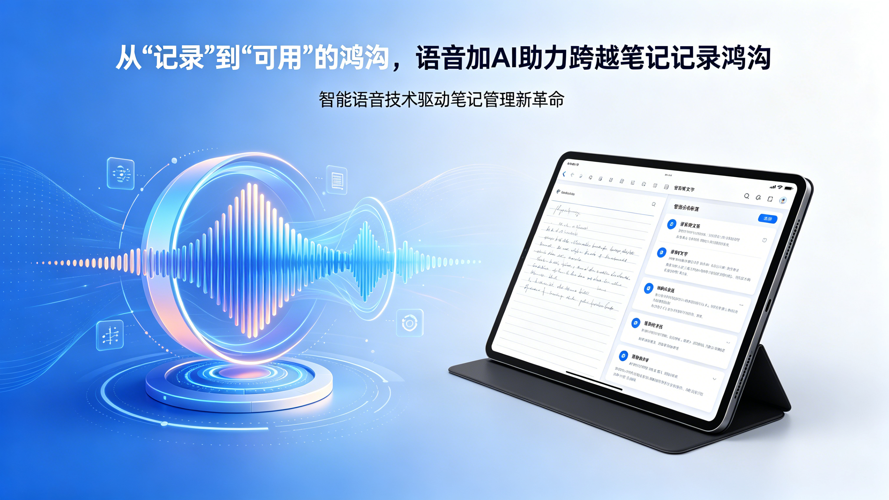

### 引言：从“记录”到“可用”的鸿沟

　　在传统场景下，记笔记主要依赖打字或手写。然而，在快节奏的现代生活中，我们常常难以抽出大块时间进行这种“高成本”的记录。语音输入因此成为一种极具吸引力的替代方案——它更快、更自然。

　　尽管市面上的语音转文字工具已能有效修正识别错误，但产出的文本往往在**逻辑连贯性和结构规范性**上存在明显不足。口语与书面语之间，始终横亘着一道难以逾越的鸿沟。

　　幸运的是，大模型（AI）的出现为我们提供了完美的桥梁。通过AI的智能处理，我们可以将原始的语音草稿，高效地转化为可直接使用的结构化文档，从而极大地缩短了从“有记录”到“有可用记录”的距离。

### 核心理念：80%说 + 20%改

　　我的核心观点是：**记笔记不应再是一项令人反感的负担，而应是一种自然的语言交流。**

　　过去，我们可能需要投入10分精力去“写”笔记。如今，借助“语音+AI”的组合，我们可以将重心调整为：

- ​**8分精力用于“说”** ：专注于思考和表达，以最自然的方式将想法倾诉出来。
- ​**2分精力用于“改”** ：对AI整理后的初稿进行快速审阅和微调。

　　由于说话的速度远快于打字，这一模式能显著降低记录的心理门槛和时间成本，让知识沉淀变得轻而易举。

### 我的实践工作流

　　具体操作流程如下：

1. ​**随时捕捉**：当灵感闪现、一天结束需要复盘，或会议刚刚散场时，立即打开录音功能，用最自然的语言说出你的想法。
2. **AI智能整理**：将语音转写的原始文本，交给一个**专门为笔记场景定制的AI智能体**（我快速创建了一个名为“Voice2Doc 整理”的智能体便于使用）。这个智能体会根据预设的规则（如日记、技术文档、灵感清单等），自动进行格式化、结构化和语言规范化。
3. ​**最终审阅**：将AI输出的整洁文档粘贴至你的笔记软件中，快速浏览一遍，确认其准确传达了你的本意，必要时进行细微调整。

　　通过这种方式，记笔记的整个过程变得流畅而高效。你不再需要在“记录”和“思考”之间艰难切换，而是可以全身心地投入到思考本身。

### 关于“能力退化”的思考：工具是赋能，而非替代

　　或许有人会担忧：“如果都依赖AI来整理，我们的逻辑思维和写作能力会不会退化？”

　　这种担忧，类似于AI编程刚出现时的讨论。确实，有一部分人坚持使用传统的编程方式。但关键在于，​**技术的进步并非要求我们“替换”，而是为我们提供“更多选择”** 。

　　采用AI辅助记笔记，并不意味着我们要彻底抛弃手写或打字。相反，我们应该根据不同的场景灵活选择工具：

- 在需要深度思考、构建复杂逻辑时，传统的书写方式依然是不可替代的训练。
- 在需要快速捕捉灵感、记录日常或整理会议时，“语音+AI”的模式则能极大提升效率。

　　这就像一位资深程序员，他依然理解底层代码的每一个细节，但在日常开发中，他会熟练地运用各种框架和工具来加速工作。**工具的目的是解放我们的创造力，让我们能将精力集中在更高价值的事情上，而不是取代我们思考的能力。**

### 结语：拥抱人机协作的新范式

　　AI并非要取代我们的思考，而是作为一位高效的协作者，帮我们处理那些重复、繁琐的“体力活”。在记笔记这件事上，将“说”与“AI整理”相结合，正是人机协作提升个人生产力的一个绝佳范例。

　　我希望这套方法能为你带来启发，让你也能轻松跨越那道“语音到文字”的鸿沟，让每一次思考都得以被完美地保存和利用。
