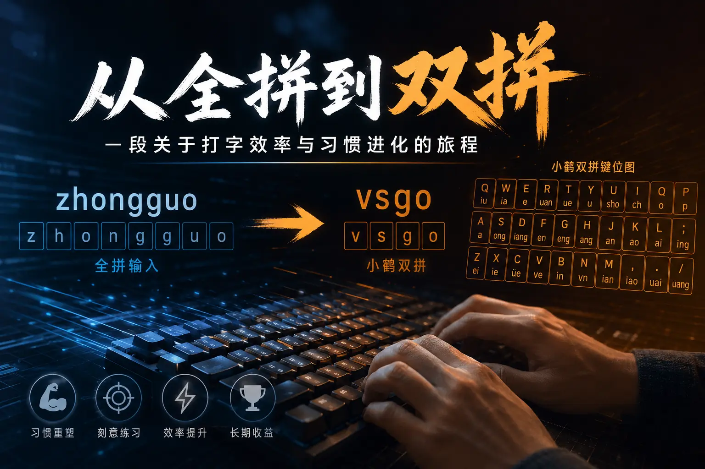

## 缘起：网吧里的野蛮生长

接触计算机是在小学时代。那时的村口网吧简陋而嘈杂，笨重的“大屁股”CRT显示器散发着温热的电子味。那是我的游戏启蒙地，从《罪恶都市》的街头狂飙、《流星蝴蝶剑》的刀光剑影，到后来的《穿越火线》与《英雄联盟》。

没人教过我怎么用键盘，一切都是为了赢。为了在游戏中活下来，我摸索出了自己的按键逻辑。虽然手指在键盘上飞舞，但那是纯粹的肌肉记忆，指法混乱且毫无章法。那时候的“会打字”，仅限于游戏快捷键的熟练度，离真正的文字输入相去甚远。

## 觉醒：告别“二指禅”

大学时，我拥有了第一台笔记本电脑。虽然脱离了网吧环境，但我的打字习惯依然停留在“随心所欲”的阶段：无法盲打，视线必须时刻锁定键盘，错字连篇。

大四寒假，我痛定思痛，决定系统性地重塑这项技能。检索后发现，打字竟是一门严谨的学科。我找了一个专业的打字练习网站，从最枯燥的基准键位（ASDF JKL;）开始，强迫自己矫正指法。

从全拼的基础练习到中英文混打，每天坚持一小时。仅仅十几天，量变引起了质变——我终于实现了全拼盲打。虽然速度算不上顶尖，但那种指尖在键盘上流淌出文字的掌控感，让我第一次体会到了“标准”的魅力。

## 进化：为何选择双拼？

全拼虽好，但效率瓶颈很快显现。输入“中国”需要敲击 `zhongguo` 八次，这种冗余让我难以忍受。我渴望一种更高效的方案，但又不想挑战五笔字型那复杂的拆字逻辑。

于是，双拼进入了我的视野。

双拼是一种音码方案，它的核心逻辑极其优雅：将所有汉字的输入固定为两次击键。
- **原理**：将声母和韵母强制映射到单个按键上。
- **规则**：每个字由声母和韵母组成。
- **特例**：对于零声母字（如“安”），采用 `零声母键 + 韵母键` 的模式。

以最经典的小鹤双拼为例，输入“中国”：
- 全拼：`zhongguo`
- 双拼：`vsgo`
这不仅仅是按键次数的减少，更是思维与输出之间延迟的极致压缩。

小鹤双拼键位图

## 实战：痛苦与快乐并存的练习

学习双拼的过程，是一次对肌肉记忆的重写。

1. **方案选择**：市面上有搜狗、小鹤、自然码等多种方案。我选择了键位布局较为均衡的小鹤双拼。
2. **死记硬背**：初期必须对着键位图记忆。B站上有很多口诀记忆法，非常实用。
3. **环境隔离**：这是最关键的一步。我将电脑和手机的输入法全部强制切换为双拼。

刚开始的那几天是痛苦的。看着键盘上的字母，脑子里想的却是声韵母的映射，打字速度慢得让人想摔键盘，回个消息都要半天。我把键位图抄在纸上贴在屏幕前，想不起来就偷瞄一眼。

但坚持就是胜利。随着练习量的积累，那种“卡顿感”逐渐消失，取而代之的是行云流水的快感。当手指形成新的肌肉记忆后，双拼带来的效率提升是惊人的。

## 经验总结：给后来者的建议

如果你也想从全拼通过双拼进阶，我有几条建议：

- **刻意练习**：双拼是一项技能，不是知识。最快的掌握方法就是高强度的打字练习。
- **破釜沉舟**：给自己创造一个“不得不打”的环境。电脑手机全换双拼，练习期间严禁切回全拼，哪怕慢也要坚持。
- **善用工具**：
    - 全拼练习：[https://daziya.com/](https://daziya.com/)
	- 双拼练习：[https://dazigo.vip/](https://dazigo.vip/)

## 结语

写这篇文章时，我正流畅地使用着小鹤双拼。

从“zhongguo”到“vsgo”，改变的不仅仅是按键次数，更是一种对工具掌控力的进化。

随着科技的飞速发展，打字的形态或许会被重新定义。如今，语音输入已逐渐成为主流，而在不远的未来，脑机接口技术甚至可能让我们仅凭“意念”就能完成文字输入与计算机控制。然而，在物理交互被彻底取代之前，传统的键盘输入在很长一段时间内，依然是我们不可或缺的核心技能。

很多时候，我们以为自己“会”了某项技能，其实只是停留在“能用”的层面。对于那些看似掌握实则低效的习惯，只需投入少量的时间去系统化纠正，就能换来长期的效率红利。这，或许就是技术的魅力。
