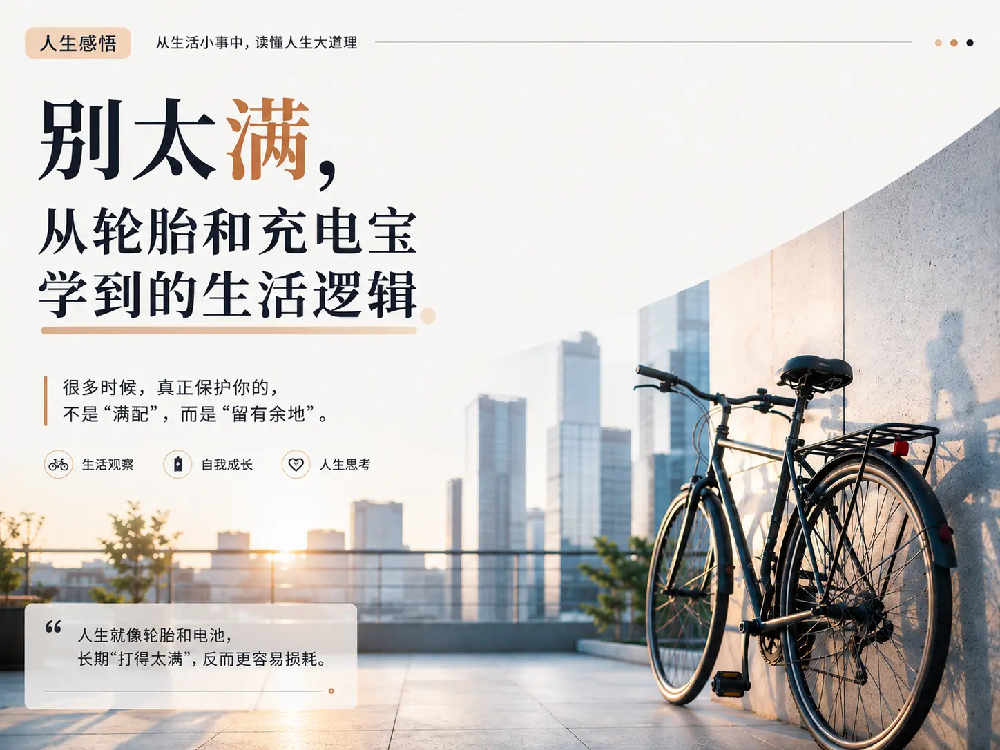

> 生成时间：2026-08-03
> 基于个人笔记：《从自行车轮胎和充电宝的保养想到的人生启示》

## 公众号文章

**标题：别太满，从轮胎和充电宝学到的生活逻辑**

假期几个月不在学校，我特意把自行车轮胎的气打到了最满。

想着几个月不骑，气打足了，轮胎不容易瘪，回来还能直接骑。当时还觉得自己考虑得挺周到。

结果回来一看——轮胎裂了。

不是没气，是撑裂的。

我当时站在屋檐下愣了好几秒。明明是好心，怎么反而把东西弄坏了？

后来查了才知道：轮胎长期不用，应该放半满，而不是打满。打满了，橡胶长期处于高压状态，受力点一直在同一个地方，反而加速老化。

原来我以为的"保护"，其实是"伤害"。

---

这事让我想起充电宝。

以前我也是用完就充满，然后扔抽屉里，觉得这样啥时候用都不慌。后来才发现，充电宝长时间不用，电量保持在 50% 左右才是最佳存放状态。满电存放，对锂电池反而是损耗。

你看，轮胎和充电宝，两个完全不同的东西，给出了同一套逻辑：**长期存放，别搞那么满。**

---

我不是在跟你讲生活小妙招。

我是想说，人生好像也一样。

你有没有发现，那些把自己排得太满的人，反而最容易崩溃？

日程表塞到分钟级，周末也要"高效利用"，连放松都要定个目标——「今天必须看完一本书」「这个假期要学完一门课」。

不是说上进不好。但一个长期处于"满气"状态的人，就像那个被我打满气的轮胎——不是更结实了，而是更容易裂。

我自己就经历过。有段时间我特别拼，每天给自己列七八项任务，做不到就焦虑，做到了就继续加码。结果某一周突然什么都不想干了，不是懒，就是心里那个弦，好像断了。

后来我慢慢明白一件事：人跟轮胎一样，也需要"半满"。

不是让你躺平。

是留点余地。留点力气在周日早晨发呆，留点精力去楼下散个没目的的步，留点时间做点"没用但开心"的事。这些看起来浪费的东西，恰恰是保护你内心那层橡胶的缓冲层。

---

还有另一层领悟。

我把轮胎打满这件事，在当时是完全"合理"的——气足=不容易瘪=对车好。这个逻辑链在脑子里严丝合缝，我没有一秒怀疑过它。

可它偏偏是错的。

生活中这种"想当然"太多了。你觉得某件事就该这么干，某个道理就是对的，某个人的行为就该按你理解的那样去解释。你以为自己在"知道"，其实只是在"重复一个没被验证过的假设"。

那个裂掉的轮胎，给我上了一课：**你深信不疑的东西，可能恰恰需要验证。**

---

现在回头看，一个轮胎换两个想明白的道理，倒也值了。

写这些倒不是为了讲什么大道理。只是觉得，我们太容易把自己调到"最满"那档了，偶尔需要谁来提醒一句：松一点也行。

如果你最近也觉得有点绷，不管是时间、情绪还是对自己的期待——给它放点气。

不用非减一半，一点就好。

---
## 配图建议

### 图片 1（封面/头图）
- **内容**：一辆停在墙边的自行车，光线柔和温暖（夕阳或清晨光线），构图干净，带一点生活气息
- **位置**：文章标题下方，正文开始前
- **用途**：吸引点击，建立场景感

### 图片 2（文中插图）
- **内容**：自行车轮胎特写，能看到轮胎表面细微的老化纹理（不一定非要裂开的，纹理感即可）
- **位置**："结果回来一看——轮胎裂了。"这一段后面
- **用途**：强化视觉冲击，让读者感受到"裂开"的意象

### 图片 3（结尾图）
- **内容**：一杯半满的水/咖啡，放在窗边，光线柔和
- **位置**：文章最后一段"那你的生活里……"之前
- **用途**：呼应"半满"主题，收束情绪，留下余味

---

## 小红书笔记

**标题：🧠 "别太满"——从轮胎和充电宝学到的生活逻辑**

---

🚲 先说一个真实经历：

假期几个月不在学校，走之前把自行车轮胎打到最满。心想：气足了不容易瘪，回来直接骑。

几个月后回来——轮胎裂了。不是漏气，是撑裂的。

查了资料才知道：橡胶长期处于高压状态，受力点固定不变，会导致材料疲劳——也就是"蠕变破坏"。长期存放，半满才是最优解。

🔋 同样的事也发生在充电宝上：

锂离子电池在 100% 电量下，正极处于高氧化态，电解液分解加速。长时间满电存放，电池容量衰减更快。行业共识是 40%~60% 的电量最适合长期存储。

你看，两个完全不同的物理系统，指向同一个最优解：**不要满。**

---

📐 这里面其实有一个更底层的规律——**最优状态往往不在极值点。**

很多系统（物理的、生物的、心理的）都存在一个"最佳区间"：
- 低于它，系统效能不足
- 高于它，系统开始加速损耗
- 恰好在这个区间里，系统维持最久、运转最稳

轮胎的压力如此，电池的电量如此。

人呢？

---

🧵 长期高压对人的影响，不是"更能扛"，而是"加速磨损"。

心理学里有个概念叫"allostatic load"（非稳态负荷）——身体反复应对压力时累积的生理损耗。短期压力可以激发表现，但长期高压会让人的情绪调节能力下降、决策质量降低，甚至诱发身体疾病。

你以为在"拼"，其实是在"耗"。

就像那个轮胎——看起来气很足、很精神，实际上橡胶正在悄悄裂开。

---

🪞 但这件事给我的另一层冲击，不在"别太满"本身。

而在我打满气的那个瞬间，**我没有任何一秒钟怀疑过自己的判断。**

"气足=不容易瘪=对车好"——这个逻辑链在脑子里是自洽的。它不是错的"看起来对"，它是"感觉上完全正确"。

这才是最可怕的地方：**我们最容易犯错的地方，往往不是未知，而是"已知"。**

那些你从未质疑过的"常识"、理所当然的判断、凭直觉就认定了的结论——它们可能是你认知体系里最大的盲区。

---

📌 总结三个可以带走的思考：

**① 任何系统都有最佳区间，极值不是答案。**
不管是管理精力、规划时间、经营关系，"刚刚好"往往比"尽可能多"更高级。

**② 警惕你的"理所当然"。**
直觉觉得对的事情，值得花五分钟验证一下。那五分钟可能是你回报率最高的投资。

**③ 把每一次"没想到"变成"学到了"。**
损失不可避免，但追问一个"为什么"——你就把它变成了学费，而不是沉没成本。

---

你生活里，有没有什么一直在"打满"的东西？

评论区聊聊 👇

---

---

## 小红书配图建议

### 图片 1（封面图）
- **内容**：自行车轮胎特写 + 文字覆盖。轮胎占画面主体，上方叠加标题文字"长期存放，别打满气"
- **风格建议**：干净、有一点胶片质感或生活感，不要太精致的棚拍
- **位置**：笔记第一张图（封面）

### 图片 2（知识卡片）
- **内容**：简洁的文字卡片。纯色背景（米白或浅灰），居中写三行——
  "轮胎半满 → 防止橡胶蠕变破坏"
  "电池半满 → 降低电解液分解"
  "人生半满 → 维持心理弹性"
- **位置**：正文"两个完全不同的物理系统…"段落之后

### 图片 3（结尾卡片）
- **内容**：浅色背景文字卡，写"你的生活，有什么一直在打满？"
- **位置**：正文最后一句之前
