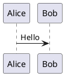

# Firefly 博客快速参考手册

> 面向日常高频操作的速查文档，涵盖文章写作、命令操作、配置要点等场景。

---

## 目录

- [一、文章写作](#一文章写作)
  - [1.1 新建文章](#11-新建文章)
  - [1.2 Frontmatter 模板](#12-frontmatter-模板)
  - [1.3 分类与标签](#13-分类与标签)
  - [1.4 Markdown 常用语法](#14-markdown-常用语法)
  - [1.5 扩展语法（Firefly 专属）](#15-扩展语法firefly-专属)
  - [1.6 写作规范](#16-写作规范)
- [二、常用命令](#二常用命令)
  - [2.1 开发与构建](#21-开发与构建)
  - [2.2 代码检查](#22-代码检查)
  - [2.3 创建内容](#23-创建内容)
- [三、核心配置速查](#三核心配置速查)
  - [3.1 站点信息修改](#31-站点信息修改)
  - [3.2 主题配色](#32-主题配色)
  - [3.3 页面开关](#33-页面开关)
  - [3.4 侧边栏配置](#34-侧边栏配置)
  - [3.5 评论系统](#35-评论系统)
  - [3.6 友链配置](#36-友链配置)
  - [3.7 导航栏配置](#37-导航栏配置)
- [四、文件目录结构](#四文件目录结构)
- [五、故障排查](#五故障排查)

---

## 一、文章写作

### 1.1 新建文章

**方式一：命令行创建（推荐）**

```bash
pnpm new-post 文章标题
```

脚本会自动：
- 将中文标题转为拼音 slug
- 生成当天日期
- 创建带完整 frontmatter 模板的 `.md` 文件
- 支持子目录：`pnpm new-post 分类/文章标题`

**方式二：Obsidian 直接创建**

`src/content/posts/` 已设为 Obsidian 符号链接，可直接在 Obsidian 中新建笔记并使用预设模板。

**方式三：手动创建**

在 `src/content/posts/` 下新建 `.md` 或 `.mdx` 文件，手动填写 frontmatter。

---

### 1.2 Frontmatter 模板

#### 标准文章模板

```yaml
---
title: 文章标题
published: 2026-08-07
updated: 2026-08-07
description: '文章摘要描述'
image: ''
tags:
  - 标签1
  - 标签2
category: 技术
draft: false
lang: ''
pinned: false
author: ''
sourceLink: ''
licenseName: ''
licenseUrl: ''
comment: true
password: ''
passwordHint: ''
---
```

#### 最简模板（日常使用）

```yaml
---
title: 文章标题
published: 2026-08-07
description: ''
tags: []
category: ''
draft: false
---
```

#### 字段说明

| 字段 | 类型 | 必填 | 说明 |
|------|------|------|------|
| `title` | string | ✅ | 文章标题 |
| `published` | Date | ✅ | 发布日期，格式 `YYYY-MM-DD` |
| `updated` | Date | | 更新日期 |
| `description` | string | | 文章摘要，用于列表和 SEO |
| `image` | string | | 封面图路径，如 `./images/cover.avif` |
| `tags` | string[] | | 标签列表，支持多个 |
| `category` | string | | 分类名称，每篇文章只能有一个 |
| `draft` | boolean | | 草稿模式，`true` 时不发布 |
| `pinned` | boolean | | 置顶文章 |
| `lang` | string | | 文章语言代码 |
| `author` | string | | 作者署名 |
| `sourceLink` | string | | 原文链接（转载时使用） |
| `licenseName` | string | | 许可协议名称 |
| `licenseUrl` | string | | 许可协议链接 |
| `comment` | boolean | | 是否开启评论，默认 `true` |
| `password` | string | | 文章密码，设置后需密码访问 |
| `passwordHint` | string | | 密码提示文字 |

---

### 1.3 分类与标签

**规则：单分类 + 多标签**

```yaml
category: 技术        # 只能写一个
tags:                 # 可以写多个
  - TypeScript
  - Astro
  - 前端开发
```

**注意：**
- `category` 是单值字符串，不写或为空则归入"未分类"
- `tags` 是数组，可以写 YAML 行内数组 `tags: [标签1, 标签2]` 或多行格式
- 系统会自动聚合所有文章的分类/标签，无需手动注册

---

### 1.4 Markdown 常用语法

#### 标题

```markdown
# 一级标题
## 二级标题
### 三级标题
#### 四级标题
```

#### 强调

```markdown
**加粗文字**
*斜体文字*
~~删除线~~
```

#### 链接与图片

```markdown
[链接文字](https://example.com)

```

#### 引用

```markdown
> 这是一段引用文字
> 可以多行
```

#### 列表

```markdown
- 无序列表项 1
- 无序列表项 2
  - 嵌套子项

1. 有序列表项 1
2. 有序列表项 2
```

#### 代码块

````markdown
```javascript
console.log('带语法高亮的代码块')
```
````

#### 行内代码

```markdown
使用 `console.log()` 输出日志
```

#### 表格

```markdown
| 列1 | 列2 | 列3 |
|-----|-----|-----|
| A   | B   | C   |
| D   | E   | F   |
```

#### 分割线

```markdown
---
```

#### 任务列表

```markdown
- [x] 已完成任务
- [ ] 未完成任务
```

---

### 1.5 扩展语法（Firefly 专属）

#### Wiki 链接（内部文章引用）

```markdown
[[markdown-tutorial]]        # 引用同目录文章
[[guide/index]]              # 引用子目录文章
[[markdown-tutorial|点这里]]  # 自定义显示文字
```

会自动生成带分类和标签信息的链接卡片。

#### Callout 提示框

```markdown
:::note
这是一条普通提示
:::

:::tip
这是一条技巧提示
:::

:::info
这是一条信息提示
:::

:::warning
这是一条警告
:::

:::danger
这是一条危险警告
:::
```

支持的类型：`note`、`tip`、`info`、`warning`、`danger`、`success`、`question`、`example`、`quote`

#### 可折叠 Callout

```markdown
:::note[点击展开]
这里是折叠的内容
:::
```

#### GitHub 仓库卡片

```markdown
:::github{repo="CuteLeaf/Firefly"}
```

#### 数学公式（KaTeX）

```markdown
行内公式：$E = mc^2$

块级公式：
$$
\int_a^b f(x) dx
$$
```

#### Mermaid 图表

````markdown

````

#### PlantUML 图表

````markdown

````

#### Tab 代码组

````markdown
:::code-group
```js [JavaScript]
console.log('hello')
```

```python [Python]
print('hello')
```

```rust [Rust]
println!("hello");
```
:::
````

#### 代码块标题

````markdown
```js title="src/app.js"
const app = 'Firefly'
```
````

#### 代码差异高亮

````markdown
```js
const x = 1
const y = 2  // [!code ++]
const z = 3  // [!code --]
```
````

#### 图片网格

```markdown
 
 
```

连续图片自动排列为网格布局。

#### 加密文章

```yaml
---
password: '123456'
passwordHint: '提示：我的生日'
---
```

---

### 1.6 写作规范

| 规范项 | 要求 |
|--------|------|
| **文件格式** | `.md` 或 `.mdx` |
| **文件命名** | 中文或英文均可，脚本会自动转拼音 slug |
| **图片存放** | 放在文章同级目录下，如 `./images/xxx.avif` |
| **图片格式** | 推荐 `.avif` 或 `.webp`，构建时自动优化 |
| **缩进** | 使用 Tab 缩进（Biome 配置） |
| **引号** | JavaScript/TypeScript 使用双引号 |
| **草稿** | 不想发布的文章设置 `draft: true` |
| **置顶** | 重要文章设置 `pinned: true` |

---

## 二、常用命令

### 2.1 开发与构建

```bash
# 启动开发服务器（热更新）
pnpm dev

# 完整构建（LQIP → 构建 → 字体子集 → 搜索索引）
pnpm build

# 本地预览构建产物
pnpm preview
```

### 2.2 代码检查

```bash
# Astro 检查
pnpm check

# TypeScript 类型检查
pnpm type-check

# 格式化 src 目录
pnpm format

# Lint 检查并自动修复
pnpm lint
```

### 2.3 创建内容

```bash
# 创建新文章
pnpm new-post <文件名>

# 创建新动态
pnpm new-dynamic <内容>

# 仅生成 LQIP（低质量图片占位符）
pnpm lqips
```

---

## 三、核心配置速查

### 3.1 站点信息修改

**文件：** `src/config/siteConfig.ts`

```typescript
// 修改以下关键字段：
title: "你的博客标题",
subtitle: "副标题",
site: "https://your-domain.com",
favicon: "/favicon.svg",
language: "zh_CN",       // 语言代码
timezone: "Asia/Shanghai",
pageSize: 10,             // 每页文章数
```

### 3.2 主题配色

**文件：** `src/config/siteConfig.ts`

```typescript
themeColor: {
  hue: 220,               // 色相值 0-360（220 = 蓝紫色）
}
```

色相参考：
- `0` - 红色
- `120` - 绿色
- `220` - 蓝紫色（默认）
- `270` - 紫色
- `340` - 粉色

### 3.3 页面开关

**文件：** `src/config/siteConfig.ts`

```typescript
pages: {
  gallery: true,          // 相册
  friends: true,          // 友链
  message: false,         // 留言板
  bangumi: true,          // 番组计划
  anime: false,           // 追番
  dynamic: true,          // 动态
  sponsor: true,          // 打赏
  bookmarks: true,        // 书签导航
},
```

### 3.4 侧边栏配置

**文件：** `src/config/sidebarConfig.ts`

```typescript
// 可用组件类型：
type SidebarItem = 
  | "profile"       // 个人信息卡片
  | "announcement"  // 公告栏
  | "categories"    // 分类列表
  | "tags"          // 标签云
  | "toc"           // 文章目录
  | "music"         // 音乐播放器
  | "pio"           // 看板娘
```

### 3.5 评论系统

**文件：** `src/config/commentConfig.ts`

支持五种评论系统：`twikoo`、`waline`、`artalk`、`giscus`、`disqus`。配置对应的 `serverURL` 或参数即可启用。

```typescript
// 示例：启用 Twikoo
type: "twikoo",
twikoo: {
  serverURL: "https://your-twikoo-server.com",
}
```

### 3.6 友链配置

**文件：** `src/config/friendsConfig.ts`

```typescript
friends: [
  {
    name: "友链名称",
    url: "https://example.com",
    avatar: "https://example.com/avatar.png",
    description: "描述文字",
  },
]
```

### 3.7 导航栏配置

**文件：** `src/config/navBarConfig.ts`

```typescript
links: [
  { name: "首页", url: "/" },
  { name: "归档", url: "/archive" },
  { name: "分类", url: "/categories" },
  { name: "标签", url: "/tags" },
  { name: "友链", url: "/friends" },
  { name: "关于", url: "/about" },
]
```

---

## 四、文件目录结构

```
lunan-blog/
├── src/
│   ├── content/
│   │   ├── posts/          # ← 文章写在这里（.md / .mdx）
│   │   ├── dynamic/        # 动态内容
│   │   └── spec/           # 规范文档
│   ├── config/             # 所有配置文件（27 个）
│   │   └── siteConfig.ts   # ← 核心站点配置
│   ├── pages/              # 路由页面
│   ├── components/         # UI 组件（Astro + Svelte）
│   ├── layouts/            # 布局模板
│   ├── styles/             # 样式文件
│   ├── utils/              # 工具函数
│   ├── plugins/            # Markdown 插件
│   ├── types/              # TypeScript 类型定义
│   ├── assets/             # 静态资源（图片等）
│   └── constants/          # 自动生成的常量（LQIP、图标）
├── public/                 # 直接托管的静态文件
├── scripts/                # 自动化脚本
│   ├── new-post.js         # 创建文章脚本
│   └── new-dynamic.js      # 创建动态脚本
├── docs/                   # 文档
├── astro.config.mjs        # Astro 配置
├── biome.json              # 格式化/Lint 配置
├── tsconfig.json           # TypeScript 配置
└── package.json            # 项目依赖与脚本
```

---

## 五、故障排查

| 问题 | 解决方案 |
|------|----------|
| 文章不显示 | 检查 `draft: true` 是否误设为草稿；检查 `published` 日期是否为未来日期 |
| 图片不显示 | 确认图片路径以 `./` 开头；确认图片文件存在且格式正确 |
| 构建失败 | 运行 `pnpm check` 和 `pnpm type-check` 检查错误；检查图片引用是否有效 |
| 分类/标签不显示 | 确认 frontmatter 中 `category` 和 `tags` 格式正确；标签须用数组格式 |
| 热更新不生效 | 重启 `pnpm dev`；检查是否有语法错误 |
| 搜索无结果 | 确保已运行 `pnpm build`（含 Pagefind 索引步骤） |
| 字体显示异常 | 检查 `src/config/fontConfig.ts` 字体配置是否正确加载 |
| 评论不显示 | 检查 `src/config/commentConfig.ts` 中对应系统的 `serverURL` 是否正确 |
